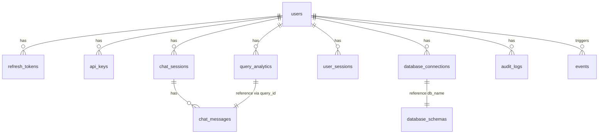

# 📑 Database Schema Documentation (app_data.db)

## 1. Overview

* **Database**: SQLite (`app_data.db`)
* **Current Alembic Revision**: `8e2fbd009a9c`
* **Total Tables**: 15

## 2. Tables & Columns

> **Legend**  
>

| #  | Table                    | Column                                                                                                                                                                                                                                   | Type                       | Constraints | Description            |
| -- | ------------------------ | ---------------------------------------------------------------------------------------------------------------------------------------------------------------------------------------------------------------------------------------- | -------------------------- | ----------- | ---------------------- |
| 1  | **users**                | id                                                                                                                                                                                                                                       | VARCHAR(36)                | PK          | UUID                   |
|    |                          | email                                                                                                                                                                                                                                    | VARCHAR(255)               | UQ·NN       | User email             |
|    |                          | password_hash                                                                                                                                                                                                                            | VARCHAR(255)               | NN          | Hashed password        |
|    |                          | full_name                                                                                                                                                                                                                                | VARCHAR(100)               | NN          | Full name              |
|    |                          | company                                                                                                                                                                                                                                  | VARCHAR(100)               |             | Company                |
|    |                          | role                                                                                                                                                                                                                                     | VARCHAR(20)                | NN          | viewer / admin         |
|    |                          | is_active                                                                                                                                                                                                                                | BOOLEAN                    | NN          | Active flag            |
|    |                          | created_at                                                                                                                                                                                                                               | DATETIME                   | NN          | Created date           |
|    |                          | updated_at                                                                                                                                                                                                                               | DATETIME                   |             | Updated date           |
|    |                          | last_login                                                                                                                                                                                                                               | DATETIME                   |             | Last login             |
|    |                          | token_usage                                                                                                                                                                                                                              | INTEGER                    | NN          | Total tokens used      |
|    |                          | preferences                                                                                                                                                                                                                              | JSON                       |             | UI & model preferences |
| 2  | **refresh_tokens**       | id (PK) · user_id (FK) · token_hash(UQ) · expires_at · revoked_at · is_active · is_revoked · device_info(JSON) · created_at                                                                                                              |
| 3  | **api_keys**             | id (PK) · user_id (FK) · key_name · key_hash(UQ) · key_prefix · permissions(JSON) · is_active · created_at · expires_at · last_used · usage_count                                                                                        |
| 4  | **chat_sessions**        | id (PK) · user_id (FK) · title · is_active · created_at · updated_at · last_message_at · message_count                                                                                                                                   |
| 5  | **chat_messages**        | id (PK) · session_id (FK) · message_type · content · query_id · sql_query · query_result(JSON) · execution_time · error_message · timestamp · sequence_number                                                                            |
| 6  | **query_analytics**      | id (PK) · query_id · user_id (FK) · question · sql_query · execution_time · row_count · success · error_message · chart_type · prompt_tokens · completion_tokens · total_tokens · llm_model · llm_cost_estimate · timestamp · created_at |
| 7  | **user_sessions**        | id (PK) · user_id (FK) · session_start · session_end · ip_address · user_agent · queries_count · is_active                                                                                                                               |
| 8  | **database_connections** | id (PK) · user_id (FK) · connection_name · db_type · db_host · db_port · db_user · encrypted_db_password · db_name · created_at · updated_at                                                                                             |
| 9  | **database_schemas**     | id (PK) · database_name · table_name · schema_info(JSON) · last_updated · row_count · table_size                                                                                                                                         |
| 10 | **audit_logs**           | id (PK) · user_id (FK) · action · resource_type · resource_id · old_values(JSON) · new_values(JSON) · ip_address · user_agent · timestamp · success · error_message                                                                      |
| 11 | **events**               | id (PK) · event_type · user_id (FK) · event_data(JSON) · timestamp · ip_address · user_agent · session_id                                                                                                                                |
| 12 | **performance_metrics**  | id (PK) · metric_name · metric_value · metric_unit · timestamp · additional_data(JSON)                                                                                                                                                   |
| 13 | **query_templates**      | id (PK) · user_id (FK) · name · description · question_template · sql_template · category · is_public · is_verified · usage_count · created_at · updated_at                                                                              |
| 14 | **system_config**        | id (PK) · config_key(UQ) · config_value(JSON) · description · is_sensitive · created_at · updated_at · updated_by                                                                                                                        |
| 15 | **alembic_version**      | version_num(PK)                                                                                                                                                                                                                          | Current migration revision |

> For full column definitions see the SQLAlchemy models in `backend/models/models.py`.

## 3. Entity-Relationship Diagram (ERD)



## 4. Maintenance Tips

1. **Migrations**  

   ```bash
   alembic revision --autogenerate -m "<change desc>"
   alembic upgrade head
   ```
2. **Backup**  

   ```bash
   sqlite3 app_data.db .dump > backup_$(date +%F).sql
   ```
3. **Cleanup Examples**  

   *Remove expired tokens, prune old logs, etc.*
4. **Documentation Workflow**  

   *Model change → Alembic revision → Apply → Update this doc & ERD*