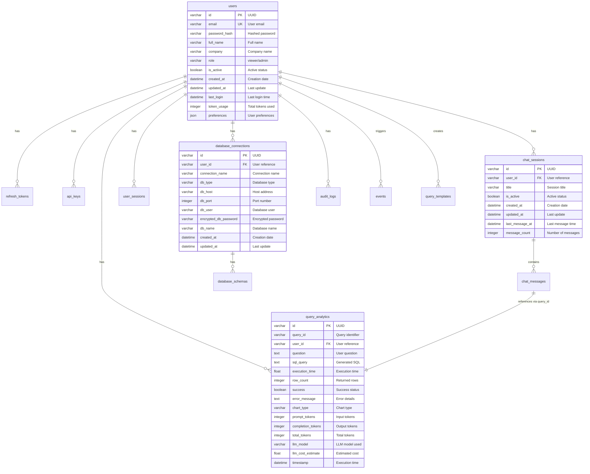
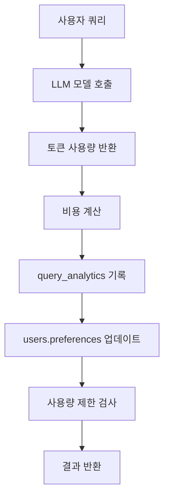

# 🗄️ Text-to-SQL 데이터베이스 설계

## 1. 개요

* **Database**: SQLite (`app_data.db`)
* **Current Alembic Revision**: `8e2fbd009a9c`
* **Total Tables**: 15

---

## 2. 사용자 및 권한 관리

### users (사용자 테이블)

| 컬럼명 | 타입 | 제약조건 | 설명 |
|--------|------|----------|------|
| id | VARCHAR(36) | PK | 사용자 식별자 (UUID) |
| email | VARCHAR(255) | UNIQUE, NOT NULL | 이메일 |
| password_hash | VARCHAR(255) | NOT NULL | 비밀번호 해시 |
| full_name | VARCHAR(100) | NOT NULL | 사용자 전체 이름 |
| company | VARCHAR(100) | NULL | 회사명 |
| role | VARCHAR(20) | NOT NULL, DEFAULT 'viewer' | 사용자 역할 (viewer/admin) |
| is_active | BOOLEAN | NOT NULL, DEFAULT TRUE | 계정 활성 상태 |
| created_at | DATETIME | NOT NULL | 생성일시 |
| updated_at | DATETIME | NULL | 수정일시 |
| last_login | DATETIME | NULL | 마지막 로그인 시간 |
| token_usage | INTEGER | NOT NULL, DEFAULT 0 | 총 토큰 사용량 |
| preferences | JSON | NULL | UI 및 모델 설정 |

### refresh_tokens (리프레시 토큰)

| 컬럼명 | 타입 | 제약조건 | 설명 |
|--------|------|----------|------|
| id | VARCHAR(36) | PK | 토큰 식별자 (UUID) |
| user_id | VARCHAR(36) | NOT NULL, FK → users.id | 사용자 참조 |
| token_hash | VARCHAR(255) | UNIQUE, NOT NULL | 토큰 해시값 |
| expires_at | DATETIME | NOT NULL | 만료 시간 |
| created_at | DATETIME | NOT NULL | 생성일시 |
| revoked_at | DATETIME | NULL | 취소 시간 |
| is_active | BOOLEAN | NOT NULL, DEFAULT TRUE | 활성 상태 |
| is_revoked | BOOLEAN | NOT NULL, DEFAULT FALSE | 취소 여부 |
| device_info | JSON | NULL | 기기 정보 |

### api_keys (API 키)

| 컬럼명 | 타입 | 제약조건 | 설명 |
|--------|------|----------|------|
| id | VARCHAR(36) | PK | API 키 식별자 (UUID) |
| user_id | VARCHAR(36) | NOT NULL, FK → users.id | 사용자 참조 |
| key_name | VARCHAR(100) | NOT NULL | 키 이름 |
| key_hash | VARCHAR(255) | UNIQUE, NOT NULL | 키 해시값 |
| key_prefix | VARCHAR(20) | NOT NULL | 키 접두사 |
| permissions | JSON | NULL | 권한 설정 |
| is_active | BOOLEAN | NOT NULL, DEFAULT TRUE | 활성 상태 |
| created_at | DATETIME | NOT NULL | 생성일시 |
| expires_at | DATETIME | NULL | 만료 시간 |
| last_used | DATETIME | NULL | 마지막 사용 시간 |
| usage_count | INTEGER | NOT NULL, DEFAULT 0 | 사용 횟수 |

---

## 3. 채팅 및 세션 관리

### chat_sessions (채팅 세션)

| 컬럼명 | 타입 | 제약조건 | 설명 |
|--------|------|----------|------|
| id | VARCHAR(36) | PK | 세션 식별자 (UUID) |
| user_id | VARCHAR(36) | NOT NULL, FK → users.id | 사용자 참조 |
| title | VARCHAR(255) | NULL | 세션 제목 |
| is_active | BOOLEAN | NOT NULL, DEFAULT TRUE | 활성 상태 |
| created_at | DATETIME | NOT NULL | 생성일시 |
| updated_at | DATETIME | NULL | 수정일시 |
| last_message_at | DATETIME | NULL | 마지막 메시지 시간 |
| message_count | INTEGER | NOT NULL, DEFAULT 0 | 메시지 수 |

### chat_messages (채팅 메시지)

| 컬럼명 | 타입 | 제약조건 | 설명 |
|--------|------|----------|------|
| id | VARCHAR(36) | PK | 메시지 식별자 (UUID) |
| session_id | VARCHAR(36) | NOT NULL, FK → chat_sessions.id | 세션 참조 |
| message_type | VARCHAR(20) | NOT NULL | 메시지 타입 (user/assistant) |
| content | TEXT | NOT NULL | 메시지 내용 |
| query_id | VARCHAR(36) | NULL | 쿼리 식별자 |
| sql_query | TEXT | NULL | SQL 쿼리 |
| query_result | JSON | NULL | 쿼리 결과 |
| execution_time | FLOAT | NULL | 실행 시간 |
| error_message | TEXT | NULL | 오류 메시지 |
| timestamp | DATETIME | NOT NULL | 생성 시간 |
| sequence_number | INTEGER | NOT NULL | 순서 번호 |

### user_sessions (사용자 세션)

| 컬럼명 | 타입 | 제약조건 | 설명 |
|--------|------|----------|------|
| id | VARCHAR(36) | PK | 사용자 세션 식별자 (UUID) |
| user_id | VARCHAR(36) | NOT NULL, FK → users.id | 사용자 참조 |
| session_start | DATETIME | NOT NULL | 세션 시작 시간 |
| session_end | DATETIME | NULL | 세션 종료 시간 |
| ip_address | VARCHAR(45) | NULL | IP 주소 |
| user_agent | TEXT | NULL | 사용자 에이전트 |
| queries_count | INTEGER | NOT NULL, DEFAULT 0 | 쿼리 실행 횟수 |
| is_active | BOOLEAN | NOT NULL, DEFAULT TRUE | 활성 상태 |

---

## 4. 쿼리 분석 및 템플릿

### query_analytics (쿼리 분석)

| 컬럼명 | 타입 | 제약조건 | 설명 |
|--------|------|----------|------|
| id | VARCHAR(36) | PK | 분석 식별자 (UUID) |
| query_id | VARCHAR(36) | NOT NULL | 쿼리 식별자 |
| user_id | VARCHAR(36) | NOT NULL, FK → users.id | 사용자 참조 |
| question | TEXT | NOT NULL | 사용자 질문 |
| sql_query | TEXT | NOT NULL | 생성된 SQL 쿼리 |
| execution_time | FLOAT | NOT NULL | 실행 시간 (초) |
| row_count | INTEGER | NOT NULL | 반환된 행 수 |
| success | BOOLEAN | NOT NULL | 성공 여부 |
| error_message | TEXT | NULL | 오류 메시지 |
| chart_type | VARCHAR(50) | NULL | 차트 타입 |
| prompt_tokens | INTEGER | NULL, DEFAULT 0 | 입력 토큰 수 |
| completion_tokens | INTEGER | NULL, DEFAULT 0 | 출력 토큰 수 |
| total_tokens | INTEGER | NULL, DEFAULT 0 | 총 토큰 수 |
| llm_model | VARCHAR(100) | NULL | 사용된 LLM 모델 |
| llm_cost_estimate | FLOAT | NULL, DEFAULT 0.0 | 예상 비용 (USD) |
| timestamp | DATETIME | NOT NULL | 실행 시간 |
| created_at | DATETIME | NOT NULL | 생성일시 |

### query_templates (쿼리 템플릿)

| 컬럼명 | 타입 | 제약조건 | 설명 |
|--------|------|----------|------|
| id | VARCHAR(36) | PK | 템플릿 식별자 (UUID) |
| user_id | VARCHAR(36) | NULL, FK → users.id | 사용자 참조 (NULL = 공개) |
| name | VARCHAR(200) | NOT NULL | 템플릿 이름 |
| description | TEXT | NULL | 설명 |
| question_template | TEXT | NOT NULL | 질문 템플릿 |
| sql_template | TEXT | NOT NULL | SQL 템플릿 |
| category | VARCHAR(50) | NULL | 카테고리 |
| is_public | BOOLEAN | NOT NULL, DEFAULT FALSE | 공개 여부 |
| is_verified | BOOLEAN | NOT NULL, DEFAULT FALSE | 검증 여부 |
| usage_count | INTEGER | NOT NULL, DEFAULT 0 | 사용 횟수 |
| created_at | DATETIME | NOT NULL | 생성일시 |
| updated_at | DATETIME | NULL | 수정일시 |

---

## 5. 데이터베이스 연결 관리

### database_connections (데이터베이스 연결)

| 컬럼명 | 타입 | 제약조건 | 설명 |
|--------|------|----------|------|
| id | VARCHAR(36) | PK | 연결 식별자 (UUID) |
| user_id | VARCHAR(36) | NOT NULL, FK → users.id | 사용자 참조 |
| connection_name | VARCHAR(100) | NOT NULL | 연결 이름 |
| db_type | VARCHAR(50) | NOT NULL, DEFAULT 'postgresql' | 데이터베이스 타입 (postgresql/oracle/sqlserver/mysql/mariadb) |
| db_host | VARCHAR(255) | NOT NULL | 호스트 주소 |
| db_port | INTEGER | NOT NULL | 포트 번호 |
| db_user | VARCHAR(100) | NOT NULL | 사용자명 |
| encrypted_db_password | VARCHAR(512) | NULL | 암호화된 비밀번호 |
| db_name | VARCHAR(100) | NOT NULL | 데이터베이스 이름 |
| created_at | DATETIME | NOT NULL | 생성일시 |
| updated_at | DATETIME | NULL | 수정일시 |

### database_schemas (데이터베이스 스키마)

| 컬럼명 | 타입 | 제약조건 | 설명 |
|--------|------|----------|------|
| id | VARCHAR(36) | PK | 스키마 식별자 (UUID) |
| connection_id | VARCHAR(36) | NOT NULL, FK → database_connections.id | 연결 참조 |
| schema_hash | VARCHAR(64) | NOT NULL | 스키마 해시 (변경 감지용) |
| raw_schema | JSON | NOT NULL | 원본 스키마 정보 |
| generated_documentation | TEXT | NULL | LLM 생성 문서 |
| table_count | INTEGER | NULL | 테이블 수 |
| total_columns | INTEGER | NULL | 총 컬럼 수 |
| last_updated | DATETIME | NOT NULL | 마지막 업데이트 |
| created_at | DATETIME | NOT NULL | 생성일시 |
| is_active | BOOLEAN | NOT NULL, DEFAULT TRUE | 활성 상태 |
| database_name | VARCHAR(100) | NULL | 데이터베이스 이름 (deprecated) |
| table_name | VARCHAR(100) | NULL | 테이블 이름 (deprecated) |
| schema_info | JSON | NULL | 스키마 정보 (deprecated) |
| row_count | INTEGER | NULL | 행 수 (deprecated) |
| table_size | VARCHAR(50) | NULL | 테이블 크기 (deprecated) |

---

## 6. 시스템 모니터링 및 감사

### audit_logs (감사 로그)

| 컬럼명 | 타입 | 제약조건 | 설명 |
|--------|------|----------|------|
| id | VARCHAR(36) | PK | 로그 식별자 (UUID) |
| user_id | VARCHAR(36) | NULL, FK → users.id | 사용자 참조 |
| action | VARCHAR(100) | NOT NULL | 수행된 액션 |
| resource_type | VARCHAR(50) | NOT NULL | 리소스 타입 |
| resource_id | VARCHAR(36) | NULL | 리소스 식별자 |
| old_values | JSON | NULL | 변경 전 값 |
| new_values | JSON | NULL | 변경 후 값 |
| ip_address | VARCHAR(45) | NULL | IP 주소 |
| user_agent | TEXT | NULL | 사용자 에이전트 |
| timestamp | DATETIME | NOT NULL | 실행 시간 |
| success | BOOLEAN | NOT NULL | 성공 여부 |
| error_message | TEXT | NULL | 오류 메시지 |

### events (이벤트)

| 컬럼명 | 타입 | 제약조건 | 설명 |
|--------|------|----------|------|
| id | VARCHAR(36) | PK | 이벤트 식별자 (UUID) |
| event_type | VARCHAR(50) | NOT NULL | 이벤트 타입 |
| user_id | VARCHAR(36) | NULL, FK → users.id | 사용자 참조 |
| event_data | JSON | NULL | 이벤트 데이터 |
| timestamp | DATETIME | NOT NULL | 발생 시간 |
| ip_address | VARCHAR(45) | NULL | IP 주소 |
| user_agent | TEXT | NULL | 사용자 에이전트 |
| session_id | VARCHAR(36) | NULL | 세션 식별자 |

### performance_metrics (성능 메트릭)

| 컬럼명 | 타입 | 제약조건 | 설명 |
|--------|------|----------|------|
| id | VARCHAR(36) | PK | 메트릭 식별자 (UUID) |
| metric_name | VARCHAR(100) | NOT NULL | 메트릭 이름 |
| metric_value | FLOAT | NOT NULL | 메트릭 값 |
| metric_unit | VARCHAR(20) | NULL | 단위 |
| timestamp | DATETIME | NOT NULL | 측정 시간 |
| additional_data | JSON | NULL | 추가 데이터 |

### system_config (시스템 설정)

| 컬럼명 | 타입 | 제약조건 | 설명 |
|--------|------|----------|------|
| id | VARCHAR(36) | PK | 설정 식별자 (UUID) |
| config_key | VARCHAR(100) | UNIQUE, NOT NULL | 설정 키 |
| config_value | JSON | NOT NULL | 설정 값 |
| description | TEXT | NULL | 설명 |
| is_sensitive | BOOLEAN | NOT NULL, DEFAULT FALSE | 민감 정보 여부 |
| created_at | DATETIME | NOT NULL | 생성일시 |
| updated_at | DATETIME | NULL | 수정일시 |
| updated_by | VARCHAR(36) | NULL | 수정자 |

### alembic_version (마이그레이션 버전)

| 컬럼명 | 타입 | 제약조건 | 설명 |
|--------|------|----------|------|
| version_num | VARCHAR | PK | 현재 마이그레이션 리비전 |

> 전체 컬럼 정의는 `backend/models/models.py`의 SQLAlchemy 모델을 참조하세요.

---

## 7. Entity-Relationship Diagram (ERD)



---

## 8. 주요 관계 설명

### 사용자 중심 구조
- **users**: 시스템의 핵심 엔티티로, 모든 사용자 관련 데이터의 중심
- **refresh_tokens**: JWT 인증을 위한 리프레시 토큰 관리
- **api_keys**: 프로그래매틱 접근을 위한 API 키 관리

### 채팅 및 쿼리 처리
- **chat_sessions**: 사용자별 대화 세션 관리
- **chat_messages**: 세션 내 개별 메시지 저장
- **query_analytics**: SQL 쿼리 실행 분석 및 LLM 토큰 사용량 추적

### 데이터베이스 연결 관리
- **database_connections**: 사용자별 외부 데이터베이스 연결 정보 (PostgreSQL, Oracle, SQL Server, MySQL, MariaDB 등)
- **database_schemas**: 연결된 분석 대상 데이터베이스의 스키마 캐시 및 LLM 문서화

### 시스템 모니터링
- **audit_logs**: 보안 및 컴플라이언스를 위한 감사 로그
- **events**: 일반적인 시스템 이벤트 추적
- **performance_metrics**: 시스템 성능 모니터링

### 🏷️ **LLM 토큰 사용량 및 과금 관리 시스템**

#### 토큰 사용량 추적 아키텍처
```
사용자 쿼리 요청 → LLM 모델 호출 → 토큰 사용량 기록 → 비용 계산 → 사용자별 집계
```

#### 핵심 구성 요소

**1. 토큰 사용량 기록 (query_analytics 테이블)**
- **prompt_tokens**: LLM 입력 토큰 수 (사용자 질문, 시스템 프롬프트)
- **completion_tokens**: LLM 출력 토큰 수 (생성된 SQL, 응답)
- **total_tokens**: 총 토큰 수 (prompt + completion)
- **llm_model**: 사용된 모델명 (gpt-4o, gpt-4o-mini, gpt-3.5-turbo 등)
- **llm_cost_estimate**: 실시간 계산된 비용 (USD)

**2. 사용자별 토큰 집계 (users.preferences.token_usage)**
```json
{
  "token_usage": {
    "total_tokens": 150000,
    "prompt_tokens": 90000,
    "completion_tokens": 60000,
    "last_updated": "2025-06-24T10:30:00Z"
  }
}
```

**3. 비용 계산 시스템 (cost_calculator.py)**
- **실시간 비용 계산**: 모델별 토큰 단가를 적용한 정확한 비용 산출
- **지원 모델**: GPT-4o ($0.0025/$0.01), GPT-4o-mini ($0.00015/$0.0006), GPT-3.5-turbo ($0.0015/$0.002)
- **자동 모델 매칭**: 모델명 부분 매칭 및 기본값 처리

**4. 사용량 제한 및 제어**
- **일일 한도**: 기본 10,000 tokens/day
- **월별 한도**: 기본 100,000 tokens/month  
- **시간당 요율 제한**: 1,000 tokens/hour
- **실시간 한도 검사**: API 호출 시점에서 제한 확인

#### 토큰 사용량 서비스 (TokenUsageService) 주요 기능

**1. 토큰 사용량 기록**
```python
await token_service.record_token_usage(
    user_id="user-123",
    session_id="session-456", 
    message_id="msg-789",
    token_usage={
        "prompt_tokens": 150,
        "completion_tokens": 80,
        "total_tokens": 230
    },
    model_name="gpt-4o-mini"
)
```

**2. 사용자별 사용량 조회**
- 기간별 사용량 통계 (일/월/전체)
- 모델별 사용량 분석
- 일별 사용량 트렌드
- 비용 분석 및 예측

**3. 실시간 제한 검사**
```python
rate_limit_status = await token_service.check_rate_limit(user_id)
if not rate_limit_status["allowed"]:
    # 요청 거부 처리
    return {"error": "Rate limit exceeded"}
```

#### 과금 관리 워크플로우

**1. 쿼리 실행 시점**
```
사용자 쿼리 → LLM 호출 → 토큰 사용량 반환 → 비용 계산 → DB 기록
```

**2. 사용자별 집계 업데이트**
```
개별 쿼리 기록 → users.preferences.token_usage 업데이트 → 제한 검사
```

**3. 관리자 모니터링**
- 전체 사용자 토큰 사용량 대시보드
- 비용 분석 및 예측
- 이상 사용 패턴 감지

#### 데이터 플로우



#### 비용 투명성 및 관리

**1. 사용자에게 제공되는 정보**
- 실시간 토큰 사용량 표시
- 쿼리당 예상 비용 안내
- 일/월 사용량 및 한도 상태
- 모델별 사용 통계

**2. 관리자 도구**
- 사용자별 사용량 모니터링
- 비용 임계값 알림
- 사용 패턴 분석
- 모델별 효율성 분석

이 시스템은 **TokenUsageService**, **cost_calculator**, **analytics_service**가 유기적으로 연동되어 완전한 토큰 사용량 추적 및 과금 관리를 제공합니다.

---

## 9. 유지보수 가이드

### 1. 마이그레이션 관리

```bash
# 새로운 마이그레이션 생성
alembic revision --autogenerate -m "변경사항 설명"

# 마이그레이션 적용
alembic upgrade head

# 마이그레이션 롤백
alembic downgrade -1
```

### 2. 데이터베이스 백업

```bash
# SQLite 백업 생성
sqlite3 app_data.db .dump > backup_$(date +%F).sql

# 백업에서 복원
sqlite3 new_app_data.db < backup_2025-06-24.sql
```

### 3. 정리 작업 예시

```sql
-- 만료된 리프레시 토큰 정리
DELETE FROM refresh_tokens 
WHERE expires_at < datetime('now') OR is_revoked = 1;

-- 오래된 이벤트 로그 정리 (30일 이상)
DELETE FROM events 
WHERE timestamp < datetime('now', '-30 days');

-- 비활성 사용자의 오래된 세션 정리
DELETE FROM user_sessions 
WHERE is_active = 0 AND session_end < datetime('now', '-7 days');
```

### 4. 성능 최적화

```sql
-- 인덱스 확인
.schema users
.schema query_analytics
.schema chat_sessions

-- 통계 업데이트 (SQLite는 자동으로 처리하지만 필요시)
ANALYZE;
```

### 5. 문서화 워크플로우

1. **모델 변경** → `backend/models/models.py` 수정
2. **마이그레이션 생성** → `alembic revision --autogenerate`
3. **마이그레이션 적용** → `alembic upgrade head`
4. **문서 업데이트** → 이 파일(`DB_SCHEMA.md`) 및 ERD 갱신
5. **테스트 실행** → 변경사항 검증

---

## 10. 보안 고려사항

### 민감 데이터 보호
- **password_hash**: bcrypt 해싱 사용
- **encrypted_db_password**: AES 암호화 적용
- **token_hash**: SHA-256 해싱
- **api_keys**: 해시된 형태로만 저장

### 접근 제어
- **role 기반 권한**: viewer/admin 역할 구분
- **API 키 권한**: 세분화된 permissions JSON 설정
- **세션 관리**: 토큰 만료 및 취소 메커니즘

### 감사 및 모니터링
- **audit_logs**: 모든 중요 액션 기록
- **events**: 시스템 이벤트 추적
- **user_sessions**: 사용자 활동 모니터링

---

*이 문서는 `backend/models/models.py`의 SQLAlchemy 모델을 기반으로 작성되었습니다.*