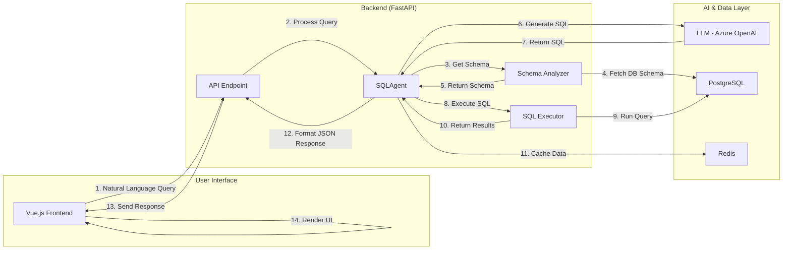

# Advanced Text-to-SQL Agent: System Design

This document outlines the system design for an advanced Text-to-SQL AI agent. The architecture is designed to accurately and efficiently convert complex natural language questions into SQL queries, interact with a database, and provide rich, insightful results.

---

## 🚀 Core Architecture & Workflow

The system operates as a real-time, tool-augmented AI agent that processes user requests in a sequential workflow. Unlike designs that rely on offline schema pre-processing and vector search, this architecture uses a live, dynamic approach to ensure accuracy with the current database state.



### Workflow Steps:

1.  **User Query**: The user enters a natural language question (e.g., "Who are the top 5 customers by sales?") into the Vue.js frontend.
2.  **API Request**: The frontend sends the query to a FastAPI backend endpoint (`/api/v1/query`).
3.  **Agent Invocation**: The endpoint invokes the central `SQLAgent`, which orchestrates the entire process.
4.  **Schema Analysis**: The `SQLAgent` uses its `SchemaAnalyzerTool` to fetch the relevant database schema (tables, columns, data types, keys) directly from the PostgreSQL database. This ensures the agent always has the most up-to-date information.
5.  **SQL Generation**: The agent constructs a detailed prompt containing the user's question and the retrieved schema. This prompt is sent to the Azure OpenAI LLM, instructing it to generate a SQL query.
6.  **SQL Execution**: The agent receives the generated SQL and uses its `SQLExecutionTool` to safely run the query against the PostgreSQL database.
7.  **Result Formatting**: The agent bundles the SQL query, the execution results, an explanation, and token usage statistics into a structured JSON object.
8.  **Caching**: Schema information and query results are cached in Redis to accelerate future requests and reduce redundant database/LLM calls.
9.  **API Response**: The backend sends the final JSON response to the frontend.
10. **Dynamic Rendering**: The frontend parses the JSON and dynamically renders the appropriate UI components, such as a data table, a chart, or a textual analysis.

---

## 🛠️ Key Components Deep Dive

### 1. AI Agent (`SQLAgent` powered by LangChain)

The `SQLAgent` is the brain of the operation. It's a LangChain-based agent responsible for coordinating tools and interacting with the LLM. It doesn't just generate SQL; it follows a logical process of gathering information, forming a plan, and executing it.

**Core Responsibilities:**
-   Decomposing the user's request.
-   Deciding which tool to use at each step (`SchemaAnalyzerTool` or `SQLExecutionTool`).
-   Managing the context (schema, query history) for the LLM.
-   Formatting the final response.

### 2. Tools

The agent's power comes from its specialized tools:

-   **`SchemaAnalyzerTool`**: This tool connects directly to the database to perform real-time schema discovery. It can list tables, describe table columns and keys, and even fetch sample data. This "just-in-time" approach is simpler and more accurate than maintaining a separate vector index of the schema.
-   **`SQLExecutionTool`**: This tool's sole purpose is to execute SQL queries. It handles database connections, executes the query provided by the agent, and captures any results or errors, which are then passed back to the agent for interpretation.

### 3. Structured JSON Output

To ensure reliable communication between the backend and frontend, the agent's final output is always a structured JSON object. This allows the frontend to be "data-driven" and adapt its display based on the response content.

**Example `QueryResponse` JSON:**
```json
{
  "question": "What are the top 5 selling products?",
  "sql_query": "SELECT p.ProductName, SUM(od.Quantity) AS TotalQuantity FROM OrderDetails od JOIN Products p ON od.ProductID = p.ProductID GROUP BY p.ProductName ORDER BY TotalQuantity DESC LIMIT 5;",
  "results": [
    { "ProductName": "Product A", "TotalQuantity": 500 },
    { "ProductName": "Product B", "TotalQuantity": 450 },
    { "ProductName": "Product C", "TotalQuantity": 400 },
    { "ProductName": "Product D", "TotalQuantity": 350 },
    { "ProductName": "Product E", "TotalQuantity": 300 }
  ],
  "explanation": "This SQL query calculates the total quantity sold for each product by summing the quantities from the OrderDetails table. It then joins with the Products table to get product names and orders the results in descending order to find the top 5.",
  "execution_time": 0.085,
  "row_count": 5,
  "database": "northwind",
  "success": true,
  "error_message": null,
  "token_usage": {
    "prompt_tokens": 350,
    "completion_tokens": 150,
    "total_tokens": 500
  }
}
```

### 4. Dynamic Frontend (Vue.js)

The frontend is designed to be a flexible client for the powerful backend. It includes:
-   A chat-like interface for user interaction.
-   Components for rendering tables (`SqlDisplay.vue`) and charts (`DataVisualization.vue`).
-   Logic to parse the `QueryResponse` and decide which components to display, creating an interactive and informative user experience.

This architecture allows users to receive rich analytical results—including easy-to-understand data tables, in-depth reports, and intuitive charts—going beyond simple text answers. 